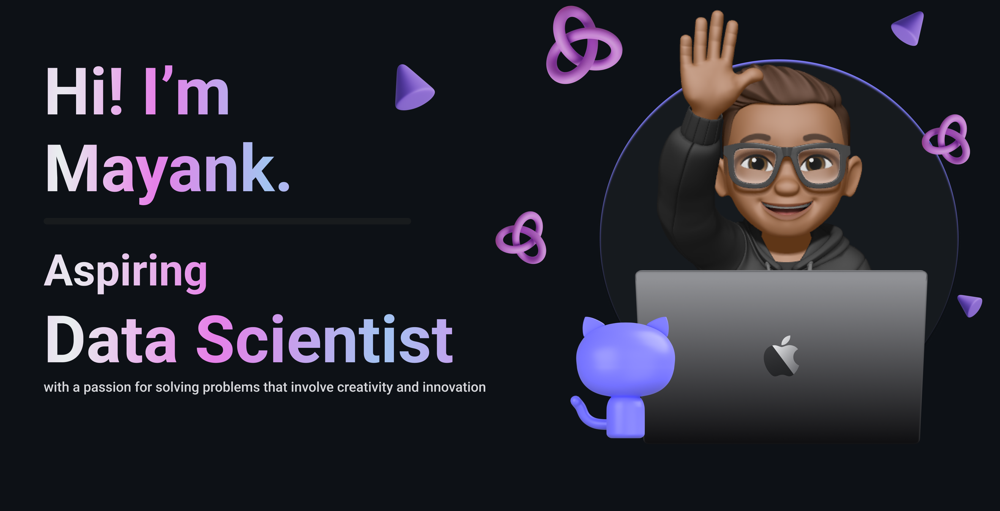

👋 Hey there! I'm Mayank, a CSE student at Manipal University Jaipur. I'm a web developer and data science enthusiast with a knack for graphic design. Let's collaborate and bring some ideas to life!
  
🔍 About Me:
<ul>
    <li>💻 Web development enthusiast with experience in React, HTML5, CSS, and JavaScript</li>
    <li>📊 Data science fan, working on visualization and analysis projects</li>
    <li>🌐 Founder of LaVisuals, an online marketplace for anime graphics</li>
    <li>🧩 Skilled in project management, team leadership, and strategic planning</li>
    <li>🚀 Passionate about creating user-friendly web platforms and Discord bots</li>
    <li>🛠️ Experienced with technologies like Firebase, PostgreSQL, and Git</li>
    <li>📚 Committed to continuous learning and skill development in tech</li>
    <li>🤝 Enthusiastic about collaborating on innovative projects and making an impact</li>
</ul>

 
Wanna connect? Hit me up! 🚀
 

	
	
	
  <a href="mailto:singhal2004mayank@gmail.com">
		

## 📈 Stats

 

  
  

---

## ⚡ Tech Stack

### 🚀 Languages

### 🧩 Libraries & Framework

### 🧑🏻‍💻 Tools & Platform

### 🧑🏻‍💻 Graphic Designing

## 🎧 Recently Listening To

